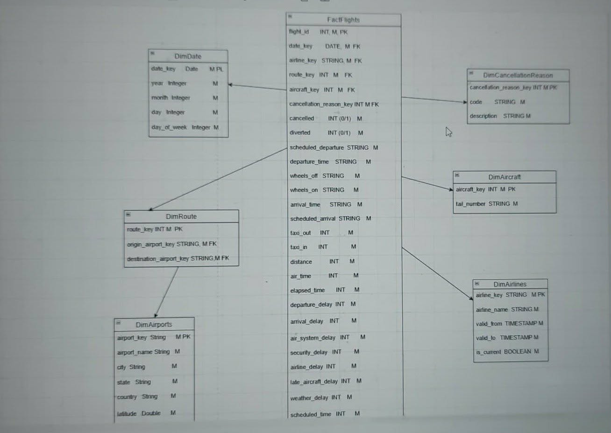

# ✈️ Flights Data Warehouse — Medallion Architecture

This project presents a complete Data Warehouse solution built on the Flights dataset, designed using the **Medallion Architecture**.  
The pipeline follows a multi-layered structure to ensure data quality, scalability, and analytical readiness.

---

## 🏛️ Architecture Overview

The solution is organized into three core layers:

### 🥉 **Bronze Layer — Raw Data**
- Stores the original Flights data in its native format  
- Minimal or no transformations  
- Ensures full traceability and reproducibility  

### 🥈 **Silver Layer — Cleaned & Structured Data**
- Data validation  
- Deduplication  
- Schema standardization  
- Business rule transformations  
- Produces high‑quality, analytics‑ready tables  

### 🥇 **Gold Layer — Business & Analytics Layer**
- Aggregated, optimized datasets  
- Supports KPIs, dashboards, and analytical workloads  
- Used for reporting, performance analysis, and BI tools  

---

## 🗺️ ERD Diagram

---

## 📊 Analysis

The project includes:

- Exploratory Data Analysis (EDA)
- Aggregations and business metrics
- Visualizations showing key insights:
  - Delays and cancellations  
  - Airline performance  
  - Seasonal and monthly trends  
  - Route‑level statistics  

---

## 🧪 Testing

The pipeline incorporates data quality and transformation tests to ensure:

- Schema consistency  
- Null and constraint validation  
- Data integrity across layers  
- Reliable metric calculations  

---

## 🛠️ Technologies & Concepts

- **Medallion Architecture** (Bronze / Silver / Gold)  
- **ETL/ELT** data processing  
- **Data validation & testing**  
- **Analytical reporting & visualization**  
- **PySpark / SQL / Delta Lake**  
- **Databricks environment**  

---
